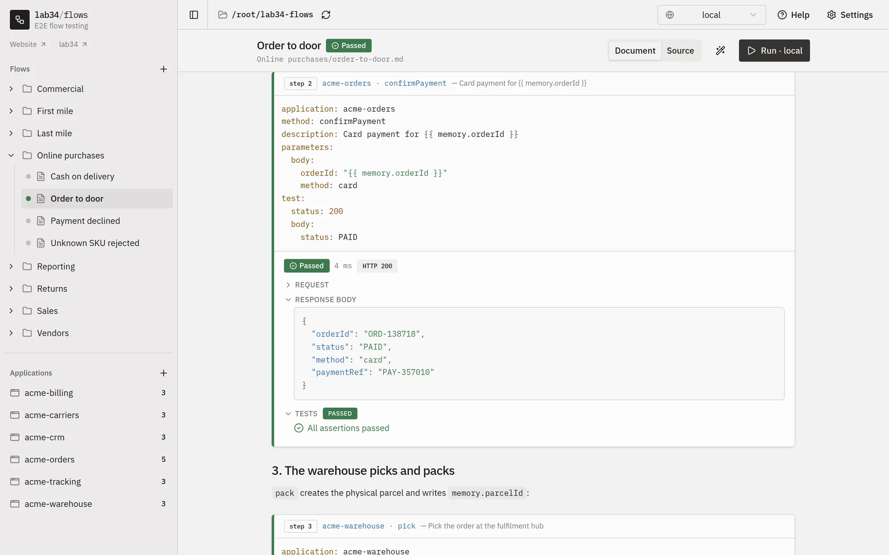
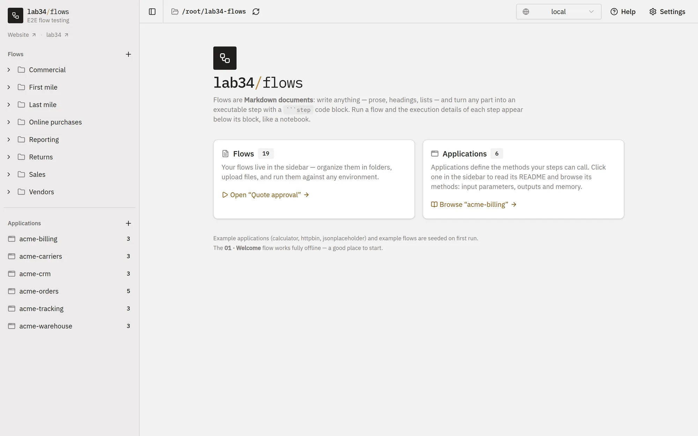
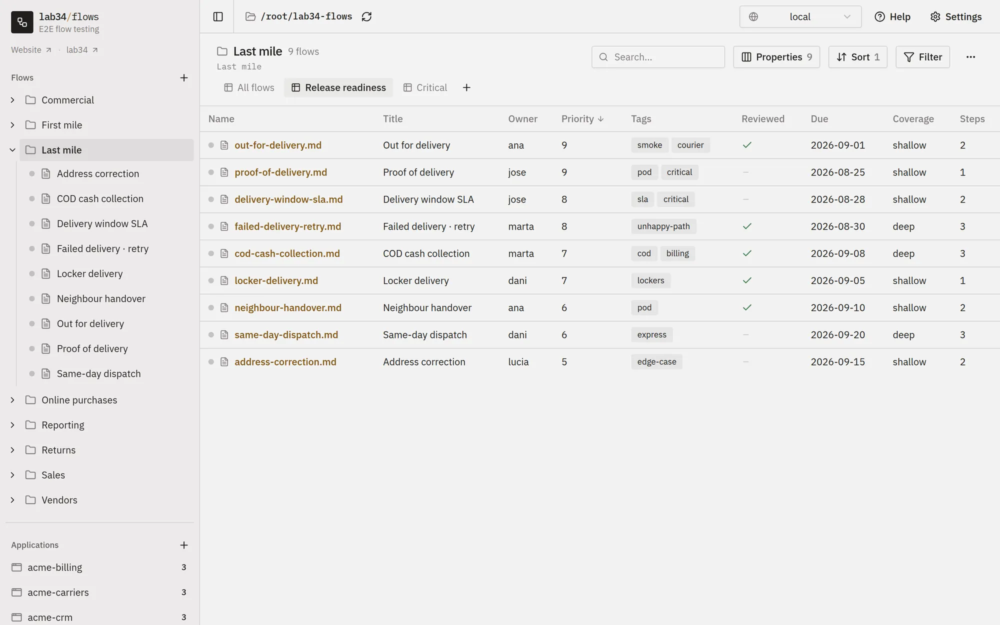
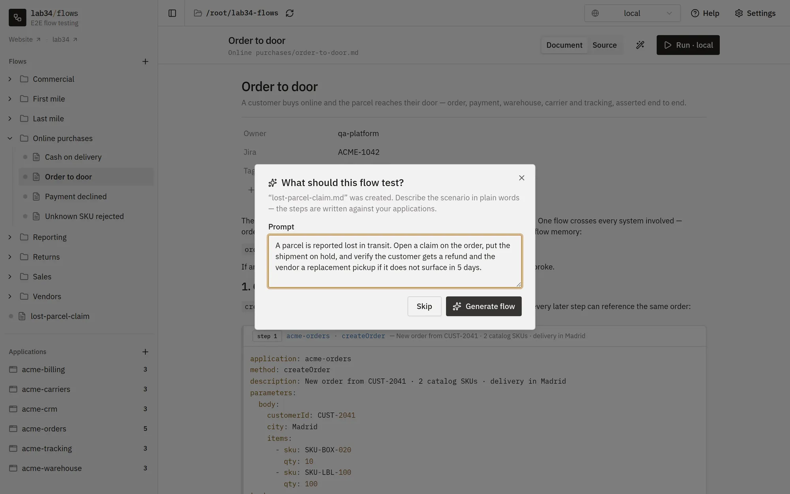
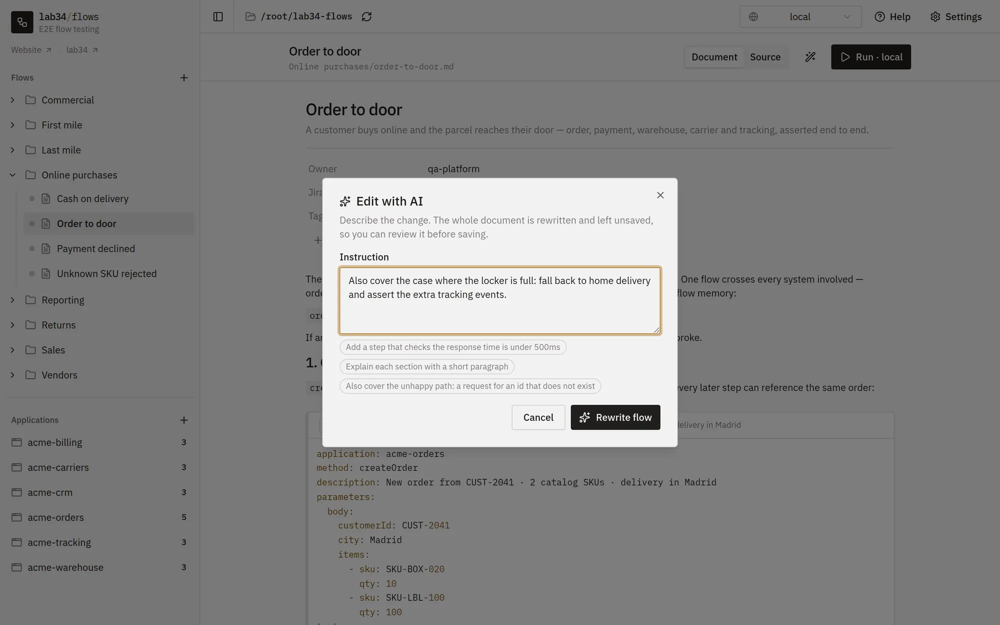
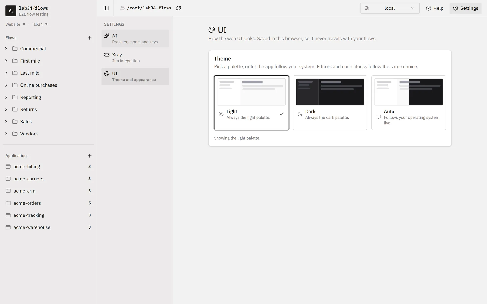

<div align="center">

# ronsel

**Trigger, understand and test E2E flows and behaviours.**

[](https://github.com/lab34-es/ronsel/actions/workflows/ci.yml)
[](https://github.com/lab34-es/ronsel/actions/workflows/ci.yml)
[](https://github.com/lab34-es/ronsel/security/code-scanning)
[](https://www.npmjs.com/package/ronsel)
[](https://www.npmjs.com/package/ronsel)

<p align="center">
  <a href="https://ronsel.lab34.es/docs/">Documentation</a> ·
  <a href="https://ronsel.lab34.es/docs/quick-start/">Quick start</a> ·
  <a href="https://ronsel.lab34.es/">Website</a> ·
  <a href="https://github.com/lab34-es/ronsel/issues">Issues</a>
</p>

<a href=".github/screenshots/flow.webp">
  
</a>

</div>

---

Ronsel is a tool for testing end-to-end flows and behaviours across the systems
you actually run: HTTP APIs, MQTT topics, PostgreSQL databases and web
applications. You can run flow from the web UI while you are writing it, from
the CLI on your machine, and unattended in your CI/CD pipelines.

A flow is a **Markdown document**. You write whatever you want — headings,
prose, notes — and mark the executable parts as ` ```step ` code blocks. Run
it, and the request, response, assertions and timings of each step appear right
below the block that produced them. Like in Python notebooks.

````markdown
---
title: Fraud detection
description: Fraud must be detected when the customer is flagged
---

# Fraud detection

The invoice endpoint must refuse to answer for a flagged customer.

```step
application: "accounting"
method: "getInvoice"
parameters:
  params:
    customerId: "{{ randomInt0_100 }}"
mimic:
  - application: "fraud"
    url: "/fraud-detection"
test:
  status: 404
  body:
    error:
      code: "ACCOUNTING_FRAUD_DETECTED"
```
````

## Screenshots

| Home | Folder | AI create | AI edit | Settings |
| --- | --- | --- | --- | --- |
| [](.github/screenshots/home.webp) | [](.github/screenshots/folder.webp) | [](.github/screenshots/ai-create.webp) | [](.github/screenshots/ai-edit.webp) | [](.github/screenshots/settings.webp) |

## Features

- **Flows as Markdown.** Documentation and executable steps in the same file,
  versioned in your own git repository.
- **Notebook-style web UI.** Live status per flow, folder views you can sort and
  filter, and per-step execution details.
- **Write flows with AI.** Describe a scenario and get a flow built from your own
  applications — with local Ollama, Google Gemini or Anthropic.
- **Assertions built in.** Assert status and body, including JavaScript
  expressions, and reuse the same flows in CI/CD through the CLI.
- **Mimic dependencies.** Fake what a dependency answers so failure scenarios
  can be reproduced locally.
- **Multi-protocol.** HTTP APIs, MQTT (including asynchronous, out-of-band
  assertions), PostgreSQL and browser automation via Playwright.
- **Random data on every run.** A large set of replacers for ids, dates and
  fake data.
- **Secrets stay out of the repo.** One env file per application per
  environment, kept in your context folder. An environment exists as soon as
  one application declares it, and a run only asks for the files of the
  applications its flow actually uses.
- **Onboarding in one paste.** Export whichever applications, environments and
  variables a teammate needs as a single YAML document; importing it creates
  the env files they are missing and fills in the rest.
- **Batteries included.** Example applications and flows are seeded on first run.

## Install

Requires Node.js `>= 24.0.0` (the current active LTS line).

```bash
npx ronsel start   # in the folder the flows should live in
```

That turns the folder into a project: a context with the example flows and
applications, and a `package.json` that depends on ronsel and carries the
command as a script. From then on -- for you, and for anybody who clones the
folder -- the whole thing is:

```bash
npm install
npm run ronsel
```

Nothing has to be installed globally. If you would rather have it on the PATH:

```bash
npm install -g ronsel
```

Browser automation needs one extra step: Playwright ships with the package but
its browsers do not, so download them once before running a flow that drives a
browser.

```bash
npx playwright install          # all three browsers
npx playwright install chromium # or just the one you use
```

See [Quick start](https://ronsel.lab34.es/docs/quick-start/) for the first-run
walkthrough.

## Usage

```bash
ronsel start                                     # make this folder a ronsel project, and start
ronsel                                           # web UI on http://localhost:3001
ronsel --context ~/my-flows                      # ... on another folder
ronsel --file flows/my-flow.md --env production  # run a flow headlessly
ronsel --view smoke-tests --env production       # run every flow a saved view matches
ronsel --import-env env.yaml --view smoke --env uat  # load the env variables, then run
ronsel --capabilities                            # list available applications and methods
ronsel --version                                 # print the installed version
ronsel --help
```

`ronsel start` is the first command: it furnishes the folder, writes the
`package.json` that pins this version and carries `npm run ronsel`, runs
`npm install` and then starts the UI. Everything it writes is additive -- an
existing `package.json` keeps its formatting and every key it had, and the
examples are seeded once and never restored. `--no-install` writes the files
and leaves the install to somebody else.

Told nothing to run, `ronsel` starts the web UI. Everything it reads and
writes — flows, applications, environments, test runs — lives in one folder,
the *context*: either the one `--context` names, or the directory the command
was run from, which it asks about before settling on it. An empty directory is
furnished with the example flows and applications on that first start; a
directory with anything already in it is served exactly as it is.

A `--view` is an scopped list of flows that matches criterias you specify via the UI.
You can get the exact cli command to run scopped filters via the UI.

`--import-env` takes the YAML the *Environment variables* screen exports and
writes it into this context's env files before anything runs — which is how a
pipeline carries its credentials as one file next to the command instead of a
folder of env files nobody can commit. Add `--dry-run` to see what it would
write without writing it.

Full reference: [Test runs](https://ronsel.lab34.es/docs/test-runs/) and
[Command line](https://ronsel.lab34.es/docs/cli/).

### Running on another machine

When the systems under test are only reachable from somewhere else -- a
machine inside a network you cannot open a port into -- the flows can run
there while you keep writing them here. Both machines connect *out* to an MQTT
broker; nothing listens on either side.

On the machine that can reach the systems, start an agent. It needs a copy of
the context (a clone of the same repository) and a name the broker knows it
by:

```bash
ronsel --context ~/ronsel-agent --agent --agent-id agent-ourense \
  --broker mqtts://mqtt.example:443 --username agent-ourense --password '...'
```

The broker address and username are stored in `config/remote.json` and the
password in the context's `.env`, so the flags are only needed once. The agent
prints its public key and stays up, waiting for jobs.

On your machine, run a flow or a view on it:

```bash
ronsel --remote agent-ourense --file flows/my-flow.md --env uat
ronsel --remote agent-ourense --view smoke --env uat
```

What travels: the commit your context is on (the agent fetches and checks it
out, so push first), and the values of the env files the flows use, encrypted
to the agent's key so the broker never sees them. What comes back: every event
of the run, printed as it happens, a prompt on your terminal when a step asks
for a value, and the test-run folder, written into your own `test-runs` as if
it had run here.

The same from the web UI: enter the broker under *Settings → Remote agents*,
pick an agent in the top bar next to the environment, and the Run buttons send
the flows there. The run shows up in the notebook and in the test runs as any
other, questions from steps included.

The agent's key is trusted the first time it is seen and refused if it ever
changes, the way ssh treats a host key. The broker itself needs TLS, one user
per machine and an ACL that confines each agent to `flows/agents/<name>/#`;
any MQTT 5 broker does (EMQX, Mosquitto, HiveMQ).

## Documentation

The whole documentation is at **[ronsel.lab34.es/docs](https://ronsel.lab34.es/docs/)**,
and the **Help** button in the app opens it. It is written and published from
its own repository, [lab34-es/ronsel-website](https://github.com/lab34-es/ronsel-website) —
corrections and new articles go there.

## Development

The package is written in TypeScript and published as CommonJS: `src/` compiles
into `dist/`, which is what `npm publish` ships, together with the type
declarations. The web UI (`frontend/`) is TypeScript too (react/mui/joy)

```bash
npm install              # CLI, API and helpers
npm run install:frontend # web UI

npm run dev              # API on :3001 + web UI on :3000, both live-reloading
                         # open http://localhost:3000 (:3001 redirects there)
npm run dev:api          # API only, restarted on change (tsx, no build step)
npm run frontend         # web UI only, Vite dev server with HMR on :3000

npm run build            # compile src/ -> dist/ and copy the bundled examples
npm run typecheck        # tsc over src/ and tests/, no emit
npm run lint             # eslint + typescript-eslint
npm test                 # jest
npm run test:coverage    # jest with the coverage gate
npm run coverage:badge   # refresh .github/badges/coverage.svg
npm run audit:ci         # fail if any critical advisory is present
```

The frontend has its own config: `npm run lint|typecheck|build --prefix frontend`.

### Quality gates

Every pull request, and every push to `master`, runs
[`.github/workflows/ci.yml`](.github/workflows/ci.yml). A change cannot land
unless all of it passes:

| Gate | What it checks |
| --- | --- |
| Lint | `eslint` over `src/`, `tests/` and `frontend/src/`, clean |
| Types | `tsc --noEmit` for the package and for the frontend, clean |
| Coverage | statements, branches, functions and lines of `src/` all **above 80%** |
| Audit | `npm audit` finds **no critical** advisory in the root or frontend tree |
| Build | `dist/` compiles and `node dist/cli.js --help` runs; the frontend builds |

The threshold lives in [`jest.config.js`](jest.config.js) (`coverageThreshold`),
so the number is defined once and CI simply runs `npm run test:coverage`.
Coverage is collected from *all* of `src/`, not only the files a test happens to
import. The release runs on the same gates: the `release` and `publish` jobs of
[`.github/workflows/ci.yml`](.github/workflows/ci.yml) depend on all of them,
so nothing ships from a red master.

### Dependency pinning

Every dependency is recorded as an exact version, with no `^` or `~` range, in
all three package trees. `.npmrc` sets `save-exact=true` so `npm install <pkg>`
keeps it that way. Upgrades are deliberate, reviewable commits rather than
something that drifts in on a fresh install.

## License

[MIT](LICENSE.md) © [Lab34](https://lab34.es)
